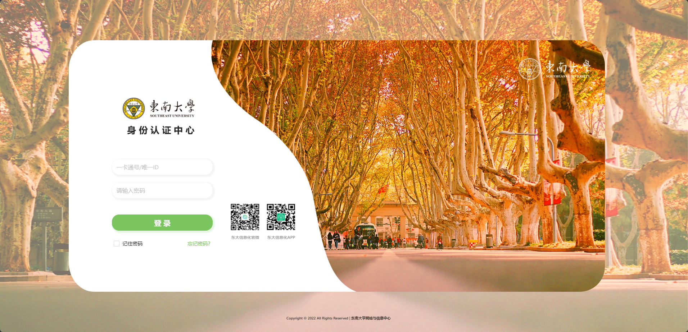
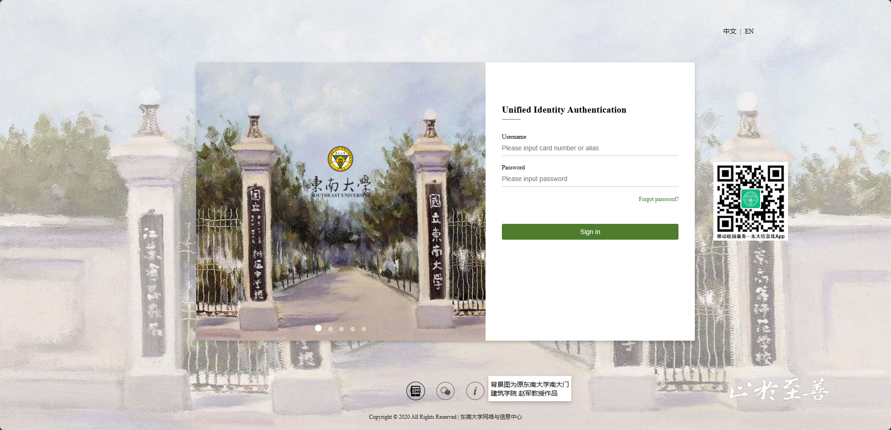
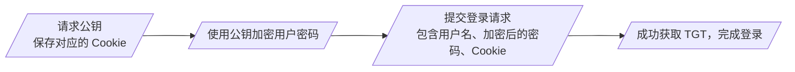
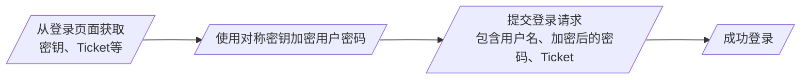

# SEU-Auth

东南大学身份认证页面的逆向、模拟登录，可用于其他自动化脚本的身份认证过程。

- [SEU-Auth](#seu-auth)
  - [SEU 身份认证系统介绍](#seu-身份认证系统介绍)
    - [新版](#新版)
    - [旧版](#旧版)
  - [目录说明](#目录说明)
  - [模拟登录脚本说明](#模拟登录脚本说明)
    - [新版](#新版)
    - [旧版](#旧版)
  - [使用示例](#使用示例)
  - [详细过程分析](#详细过程分析)

## SEU 身份认证系统介绍

目前东南大学在使用的身份认证系统有主要两个版本，分别是：

- <https://auth.seu.edu.cn/dist/#/dist/main/login>（下文中称为 **_新版身份认证系统_** ）

  

- <https://newids.seu.edu.cn/authserver/login>（下文中称为 **_旧版身份认证系统_** ）

  

现在一部分常用应用的身份认证已迁移到新版系统（比如[网上办事服务大厅](http://ehall.seu.edu.cn/)、[第二课堂](http://dekt.seu.edu.cn/)等），也还有不少还在使用旧版（比如[邮箱](https://mail.seu.edu.cn/)、[SRTP](http://cxcy.seu.edu.cn/)、网上办事服务大厅里的很多应用等），所以目前是两个版本的身份认证系统并存。

而且存在这样一种情况：访问网上办事服务大厅，经过新版身份认证登录，再访问其中的某个应用，还需要再经过旧版认证，所以本仓库对两个版本的身份认证都提供了实现。

更老的身份认证（<http://xk.urp.seu.edu.cn/studentService/system/showLogin.action>）已经基本不会再使用。

### 新版

采用 RSA 加密用户密码，公钥通过单独的请求获取，Cookie 中需要附带与公钥相匹配的 UID。

登录流程如下：

详细的登录过程分析见 [Wiki](https://github.com/Golevka2001/SEU-Auth/wiki/%E6%96%B0%E7%89%88%E8%BA%AB%E4%BB%BD%E8%AE%A4%E8%AF%81%E7%B3%BB%E7%BB%9F%E7%99%BB%E5%BD%95%E8%BF%87%E7%A8%8B%E5%88%86%E6%9E%90) 页面。

### 旧版

采用 AES 加密用户密码，密钥和 Ticket 等写在 HTML 里，Ticket 需要写在载荷中。

登录流程如下：

【登录过程分析待更新】

## 目录说明

- [`assets/`](./assets/)
- [`docs/`](./docs/)
  - [`Analysis-of-Login-Process-New.md`](./docs/Analysis-of-Login-Process-New.md)：新版身份认证系统登录过程分析
- [`examples/`](./examples/)
  - [`config.ini`](./examples/config.ini)：示例脚本的配置文件（一卡通号、密码）
  - [`login_to_dekt.py`](./examples/login_to_dekt.py)：登录第二课堂的示例脚本
  - [`login_to_ehall.py`](./examples/login_to_ehall.py)：登录网上办事服务大厅的示例脚本
- [`encrypt.js`](./encrypt.js)：AES 加密函数（来自 [CryptoJS](https://github.com/sytelus/CryptoJS)）
- [`requirements.txt`](./requirements.txt)：依赖库
- [`seu_auth_newids.py`](./seu_auth_newids.py)：旧版身份认证登录
- [`seu_auth.py`](./seu_auth.py)：新版身份认证登录
- [`LICENSE`](./LICENSE)
- [`README.md`](./README.md)

## 模拟登录脚本说明

### 新版

在 [seu_auth.py](./seu_auth.py) 中实现了模拟登录[新版身份认证系统](https://auth.seu.edu.cn/dist/#/dist/main/login)，流程如下：

1. 函数 `get_pub_key()` 从服务器请求 RSA 公钥，存储与公钥相匹配的 Cookie；
2. 函数 `rsa_encrypt()` 对用户密码进行 RSA 加密；
3. 函数 `seu_login()` 中调用以上两个函数，向服务器发送用户名（一卡通号）、加密后的密码，以及先前获取到的 Cookie，模拟登录。

web 请求使用到 [requests](https://pypi.org/project/requests/) 库，RSA 加密使用到 [pycryptodome](https://pypi.org/project/pycryptodome/) 库。

### 旧版

在 [seu_auth_newids.py](./seu_auth_newids.py) 中实现了模拟登录[旧版身份认证系统](https://newids.seu.edu.cn/authserver/login)，流程如下：

1. 函数 `get_login_data()` 从登录页面解析出 AES 密钥、Ticket 等信息；
2. 函数 `aes_encrypt()` 对用户密码进行 AES 加密；
3. 函数 `seu_login()` 中调用以上两个函数，向服务器发送用户名（一卡通号）、加密后的密码、Ticket 等，模拟登录。

web 请求使用到 [requests](https://pypi.org/project/requests/) 库，HTML 解析使用到 [BeautifulSoup4](https://pypi.org/project/beautifulsoup4/) 库，AES 加密直接使用到请求返回的 [encrypt.js](./encrypt.js)（来自 [CryptoJS](https://github.com/sytelus/CryptoJS)），JavaScript 运行使用到 [Js2Py](https://pypi.org/project/Js2Py/)。

## 使用示例

在 [examples/](./examples/) 中给出了两个使用示例，分别是：

1. [get_postgraduate_lecture_list.py](./examples/get_postgraduate_lecture_list.py)：获取研究生素质讲座列表；
2. [login_to_dekt.py](./examples/login_to_dekt.py)：登录东南大学第二课堂；
3. [login_to_ehall.py](./examples/login_to_ehall.py)：登录东南大学网上办事服务大厅。

## 详细过程分析

详细的登录过程分析见 [Wiki](https://github.com/Golevka2001/SEU-Auth/wiki/%E6%96%B0%E7%89%88%E8%BA%AB%E4%BB%BD%E8%AE%A4%E8%AF%81%E7%B3%BB%E7%BB%9F%E7%99%BB%E5%BD%95%E8%BF%87%E7%A8%8B%E5%88%86%E6%9E%90) 页面。
