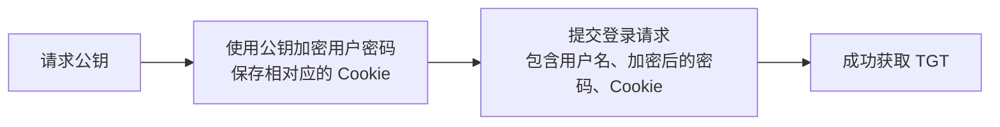

# SEU-Auth Wiki -- Analysis of Login Process

- [SEU-Auth Wiki -- Analysis of Login Process](#seu-auth-wiki----analysis-of-login-process)
  - [在登录时，我的浏览器做了什么？](#在登录时我的浏览器做了什么)
    - [1. dist `GET`](#1-dist-get)
    - [2. umi.80c8f8c8.js `GET`](#2-umi80c8f8c8js-get)
    - [3. verifyTgt `POST`](#3-verifytgt-post)
    - [4. needCaptcha `GET`](#4-needcaptcha-get)
    - [5. getChiperKey `POST`](#5-getchiperkey-post)
    - [6. casLogin `POST`](#6-caslogin-post)
  - [打断点分析 JS 中的加密逻辑](#打断点分析-js-中的加密逻辑)
  - [统一身份认证的 RSA 加密用的什么库？](#统一身份认证的-rsa-加密用的什么库)


## 在登录时，我的浏览器做了什么？

从访问[统一身份认证页面](https://auth.seu.edu.cn/dist/#/dist/main/login)到完成登录，浏览器共发起了以下请求（过滤掉了图片、样式表等静态资源）：


下面逐个来查看每个请求的作用。

### 1. dist `GET`

<details>
<summary>Response</summary>

```html
<!DOCTYPE html>
<html>
  <head>
    <meta charset="utf-8" />
    <meta
      name="viewport"
      content="width=device-width, initial-scale=1, maximum-scale=1, minimum-scale=1, user-scalable=no"
    />
    <meta name="renderer" content="webkit" />
    <link rel="stylesheet" href="./umi.174f4513.css" />
    <script>
      window.routerBase = "/dist";
    </script>
    <script>
      //! umi version: 3.5.35
    </script>
  </head>
  <body>
    <div id="root"></div>

    <script src="./umi.80c8f8c8.js"></script>
  </body>
</html>
```
</details>

也就是所看到的登录页面，但可惜的是它是动态加载的，HTML 里屁都没有，全写在 [JS](#2-umi80c8f8c8js) 里了。所以没法用 BeautifulSoup 解析，但是 Selenium 是没问题的，不过准备从直接从网络请求入手，继续来分析。

### 2. umi.80c8f8c8.js `GET`

<details>
<summary>Response</summary>

```javascript
(function(e) {
    var t = {};
    function n(r) {
        if (t[r])
            return t[r].exports;
        var o = t[r] = {
            i: r,
            l: !1,
            exports: {}
        };
        return e[r].call(o.exports, o, o.exports, n),
        o.l = !0,
        o.exports
    }

    /**********************
     ** Nearly 78k lines **
     **********************/
});
```
</details>

这位更是重量级，经过混淆、压缩后的 JS 代码，将近八万行，变量名都是混淆过的，一会儿打断点来分析一下功能和逻辑，先继续往下看请求。

### 3. verifyTgt `POST`

<details>
<summary>Payload</summary>

```json
{}
```
</details>

<details>
<summary>Response</summary>

```json
{
    "code": 400,
    "info": "user not login",
    "redirectUrl": null,
    "stCookie": null,
    "success": false
}
```
</details>

是用来验证 TGT 的有效性的，初次登录时，TGT 是不存在的，所以返回 400；成功登录后，TGT 会被存储在 Cookie 中，从而通过身份验证。暂时没用，下一个。

### 4. needCaptcha `GET`

<details>
<summary>Response</summary>

```json
{
    "code": 200,
    "info": "不需要验证码",
    "maxAge": 0,
    "redirectUrl": null,
    "success": true,
    "tgtCookie": null,
}
```
</details>

判断是否需要用户提交验证码，仍然没用，下一个。

### 5. getChiperKey `POST`

<details>
<summary>Payload</summary>

```json
{}
```
</details>

<details>
<summary>Response</summary>

```json
{
    "code": 200,
    "info": "get public key success",
    "publicKey": "MIGfMA0GCSqGSIb3DQEBAQUAA4GNADCBiQKBgQCqoEr-xxxxxx-hm2GicY9QIDAQAB",
    "success": true
}
```
</details>

好了，这个就有用了，这个请求很明显是获取了一个 Base64 编码的公钥，并且能够看出这是个 RSA 公钥（RSA 公钥开头、结尾包含了指数、模数等信息，大多格式相同）。

那么公钥是干啥用的呢？肯定是拿来加密的。加密啥呢？那就是用户输入的密码咯。

同时在响应头中还带了一个 `Set-Cookie` 字段，值为 `CHIPER_UID=53ed8871c95f49cxxxxxx; ...`，可以猜测 `CHIPER_UID` 是和公钥相匹配的，用于验证有效性。在后来的测试中发现确实如此，若二者不匹配或 Cookie 中不带 `CHIPER_UID`，会返回会话过期的错误。

### 6. casLogin `POST`

<details>
<summary>Payload</summary>

```json
{
  "captcha": "",
  "loginType": "account",
  "mobilePhoneNum": "",
  "mobileVerifyCode": "",
  "password": "dgnQOyAAQ83Ro7+eW3ZMP1TSaWhItp6+xxxxxx+iHuDKmNyRBO54iBI=",
  "rememberMe": false,
  "service": "",
  "username": "123456789",
  "wxBinded": false
}
```
</details>

<details>
<summary>Response</summary>

```json
{
    "code": 200,
    "info": "Authentication Success(no service provided)",
    "maxAge": -1,
    "redirectUrl": null,
    "success": true,
    "tgtCookie": "eyJhbGciOiJIUzUxMiIsInR5cCI6IkpXVCJ9.xxxxxx.-Rd3ZGW3szqJT-G41mX84TjtgvS20tM0eLn9i9bwq9GMXTED35DO_TgTi17UpR9F1aQYBw2c8W1T1XrtzHkptA"
}
```
</details>

这就是完成登录的最后一个请求了，可以看到在请求负载中，`username` 和 `password` 字段分别是一卡通号和加密过的密码，其他字段也可以直接直接从变量名看出来，这里就不多说了。

响应中可以看到认证成功的信息以及最重要的 `tgtCookie` 字段，这就是我们要的 TGT 了，也就是 [verifyTgt](#3-verifytgt-post) 请求中要验证的那个。


至此，登录完成，再来捋一下流程：



## 打断点分析 JS 中的加密逻辑

输入用户名 `123456` 和密码 `qweasd`，启动浏览器调试工具，打开 `umi.80c8f8c8.js`，准备打断点。


在前面的分析中已经猜测会使用 RSA 对密码加密，所以搜索 `encrypt`，得到 9 个结果，除去 4 个在字符串中，其他都是函数名以及函数调用，从代码中的一些提示信息也能够看出来这部分确实是 RSA 加密相关。对搜索结果部分都随便打打断点运行一下看看。


点击登录按钮后，先停在了这里：


在上图中可以分析得出这些信息：

`var t = kt.username` 是传入的一卡通号；

`var n = new ot` 创建了一个 RSA 加解密对象的实例，包含了位数、指数等信息；

`n.SetPublicKey(a.state.publicKey)` 为 RSA 对象设置了公钥；

`var r = n.encrypt(kt.password)` 调用了某个 `encrypt()` 函数，对传入的密码进行了加密；

`var o = kt.captcha` 是传入的验证码，不是我们关心的，跳过。

下面进入刚才调用的 `encrypt` 函数内部：


可以看到 `e` 就是输入的密码，调用了另一个 RSA Key 对象的 `encrypt()` 函数，这个 `Z()` 呢大概率是个负责格式转换或者格式化的函数。

好，继续往下看这另一个 `encrypt()` 函数：


这里调用 `Ye()` 执行的应该就是具体的加密流程了，就不再往里细看了，返回 PKCS#1 格式的加密结果，是十六进制的，所以可以猜测上面的 `Z()` 函数作用应该是将十六进制转换为 Base64 编码：


最后返回到一开始的调用处，`r` 便是最终得到的 Base64 编码的 RSA 加密结果，也就是 `casLogin` 请求的载荷中的 `password`：


## 统一身份认证的 RSA 加密用的什么库？

通过简单的搜索和比对，找到了 [jsencrypt](https://github.com/travist/jsencrypt) 这个库，函数的逻辑、功能和前文中的分析是一致的。


可以结合上正经变量名、注释再看一遍上面的过程，接下来就可以准备模拟登录了。
