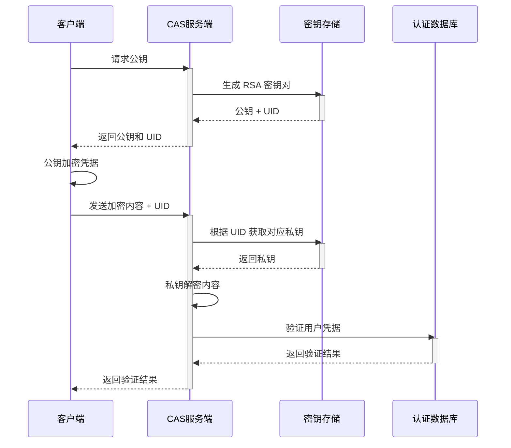

# 加密相关

## 流程图

## 使用的算法/库

- RSA
- PKCS#1 v1.5 填充
- 公钥为 PEM 格式，但不含头尾标识行，且为 Base64URL 编码
- 前端使用 [JSEncrypt](https://github.com/travist/jsencrypt)
- 本项目使用 [PyCryptodome](https://github.com/Legrandin/pycryptodome)
