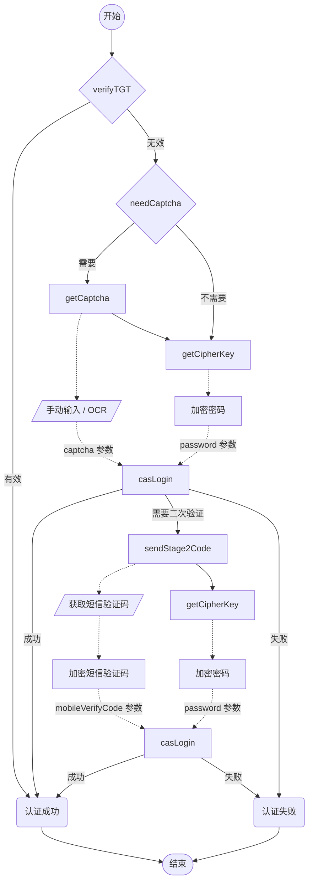

# 认证流程概述

> 认证页面：<https://auth.seu.edu.cn/dist/#/dist/main/login>  
> 最后更新于：2025-12-03

本文档为 SEU 身份认证流程的概述，简要介绍介绍流程中的几个主要步骤的作用及顺序。

由于**系统可能不时更新**，具体细节可能会有所变化（比如几个月前加了设备指纹和短信验证码），本文档**仅供参考**。
如发现过时、有误的内容，可提交 issue 或 PR 进行修正。
其他文档中不再重复此部分声明。

## 主要步骤

以下格式为 "`[METHOD]` `[ENDPOINT]`：简要说明"。
Base URL 为 <https://auth.seu.edu.cn/auth/casback/>

1. `POST` `verifyTGT`：验证当前 TGT Cookie，若存在且有效，则是已登录状态；否则需要执行后续认证流程。
2. `GET` `needCaptcha`：检查是否需要输入验证码，若需要，则获取验证码，在发起登录请求时需要带上；否则跳过 3。
3. `GET` `getCaptcha`：获取图片验证码
4. `POST` `getChiperKey`：获取 RSA 公钥，用于加密用户密码（Typo："cipher" 被写成了 "chiper"，不知道后面会不会改）。
5. `POST` `casLogin`：发起登录请求，若成功登录，则可以结束流程；若提示需要二次认证，则继续后续流程。
6. `POST` `sendStage2Code`：触发发送短信验证码。
7. `POST` `getChiperKey`：再次获取公钥，用于加密**用户密码和短信验证码**。
8. `POST` `casLogin`：再次发起登录请求，若成功登录，则结束流程；否则登录失败。

对上述各个请求的细节介绍以及请求、响应示例，请参考 [认证流程请求细节](https://github.com/Golevka2001/SEU-Auth/wiki/details-of-requests.md)。

## 流程图

