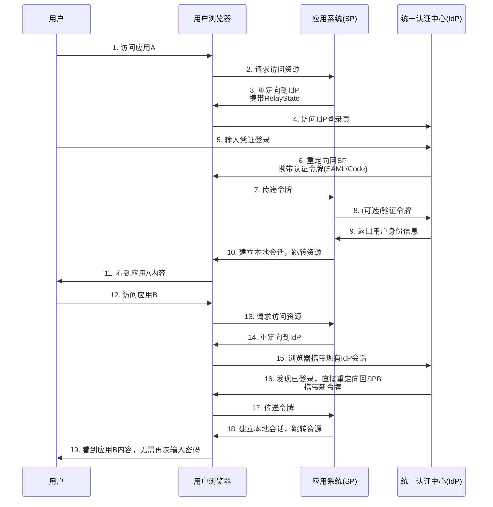

# SSO

一个典型的 SSO 流程如下所示：

```mermaid
sequenceDiagram
    participant User as 用户
    participant Browser as 用户浏览器
    participant SP as 应用系统(SP)
    participant IdP as 统一认证中心(IdP)

    User->>Browser: 1. 访问应用A
    Browser->>SP: 2. 请求访问资源
    SP->>Browser: 3. 重定向到IdP<br>携带RelayState
    Browser->>IdP: 4. 访问IdP登录页
    User->>IdP: 5. 输入凭证登录
    IdP->>Browser: 6. 重定向回SP<br>携带认证令牌(SAML/Code)
    Browser->>SP: 7. 传递令牌
    SP->>IdP: 8. (可选)验证令牌
    IdP->>SP: 9. 返回用户身份信息
    SP->>Browser: 10. 建立本地会话，跳转资源
    Browser->>User: 11. 看到应用A内容

    User->>Browser: 12. 访问应用B
    Browser->>SP: 13. 请求访问资源
    SP->>Browser: 14. 重定向到IdP
    Browser->>IdP: 15. 浏览器携带现有IdP会话
    IdP->>Browser: 16. 发现已登录，直接重定向回SPB<br>携带新令牌
    Browser->>SP: 17. 传递令牌
    SP->>Browser: 18. 建立本地会话，跳转资源
    Browser->>User: 19. 看到应用B内容，无需再次输入密码
```
